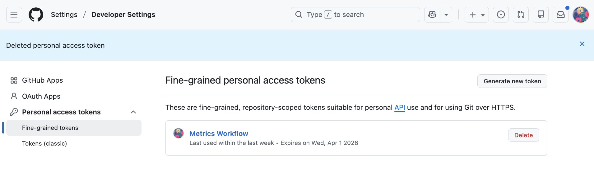
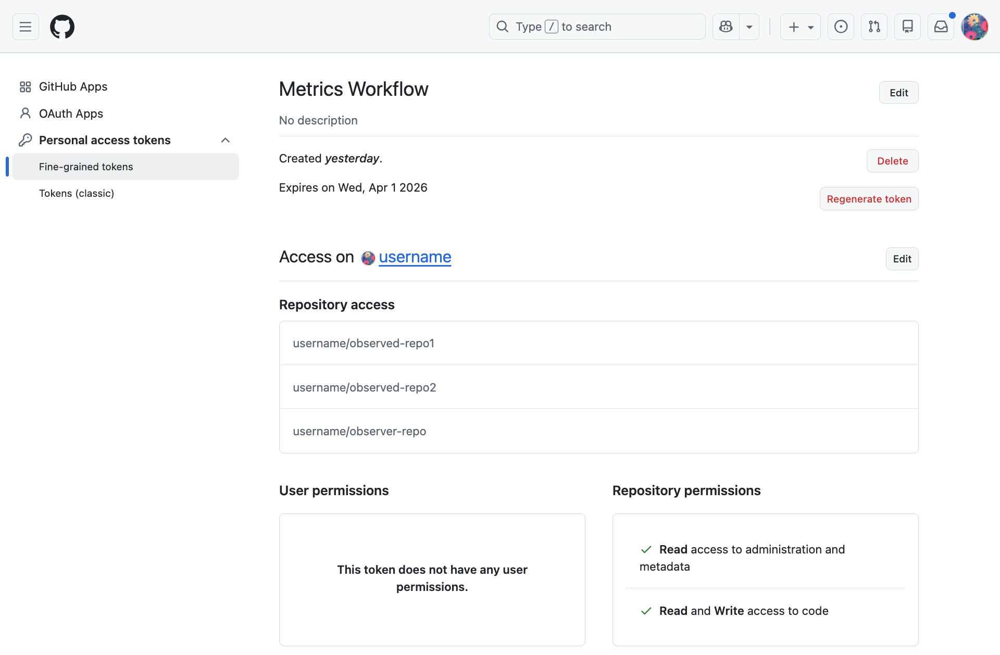

# Metrics Workflow 📊

This is a reusable GitHub Actions workflow designed to automate the collection and archival of repository clone statistics. It solves the "14-day limit" problem of GitHub's native traffic insights by persisting data into a central repository.

## 🏗 Architecture

The system uses a **three-repo architecture** to maintain security and organization:

1. **Workflows Repo (`metrics-workflows`)**: Central hub containing the reusable logic (`metrics.yml`).
2. **Observed Repo(s)**: The repositories being tracked. Each triggers the workflow on a schedule.
3. **Observer Repo (`metrics-database`)**: The central storage where `.csv` files are maintained and updated.

---

### 🔍 How it Works

GitHub only keeps traffic data (clones and visitors) for **14 days**. This workflow acts as a "Data Logger":

1. It wakes up every day and asks the GitHub API for the clone history of the **Observed Repo**.
2. It compares this data with the existing logs in your **Observer Repo**.
3. It appends only the most recent data and updates the "14-day total" summary.
4. It deduplicates the file and sorts it so the most recent stats are always at the top.

> [!IMPORTANT]
> **Access Requirement:** You must be the owner or a collaborator with appropriate permissions on the **Observed Repos**. This workflow requires an authorized Personal Access Token (PAT) to read traffic data that is otherwise hidden from the public.


---

## 🔐 Security & Permissions

To allow a workflow running in an **Observed Repo** to write data to the **Observer Repo**, specific permissions must be configured via a Fine-Grained Personal Access Token (PAT).

### 1. The Personal Access Token (PAT)

Create a token named **"Metrics Workflow"** in your [Developer Settings](https://github.com/settings/tokens?type=beta) under Personal Access Tokens/Fine-grained tokens:

* **Repository access**:
 * Select **Only select repositories**.
 * Include all **Observed Repositories** AND the **Observer Repository**.


* **Permissions**:
 * `Administration`: Read-only (required for some traffic API metadata).
 * `Metadata`: Read-only.
 * `Contents`: **Read & Write** (Required to push `.csv` updates).



### 2. Repository Secrets

In **each** Observed Repo (Settings > Secrets and variables > Actions), add the following secret:

* **Name**: `METRICS_PAT`
* **Value**: Paste the token generated above.

> [!NOTE]
> While it may seem like the Observer repo doesn't need a "separate" PAT, it is actually covered by the **"Metrics Workflow" PAT** you created. Because that single token has "Write" access to the Observer repo, it can push the data once the workflow finishes gathering it.


---

## 🚀 Usage

To implement this in an **Observed Repo**, create a file at `.github/workflows/metrics.yml`:

```yaml
name: Collect Metrics

on:
  schedule:
    - cron: '0 0 * * *' # Runs daily at midnight
  workflow_dispatch:    # Allows manual triggering

jobs:
    update-metrics:
    # This is required for the runner to operate within the Observed repo
    permissions:
      contents: read

    # You can point this to your own forked workflows repo if preferred
    uses: groda/github-clone-archiver/.github/workflows/metrics.yml@v1
    
    with:
      metrics-repo: YOUR-USERNAME/observer-repo
    secrets:
      METRICS_PAT: ${{ secrets.METRICS_PAT }}

```

This is your caller workflow for the observed repository.

---

## 📊 Data Architecture

The workflow automates the collection of traffic data into a persistent CSV format. Unlike the default GitHub dashboard, this data never expires.

### Storage Logic

The system generates or updates a CSV file named using the pattern `[YOUR-USERNAME]_[repo].csv` (e.g., `groda_my-project.csv`). This file is automatically committed to your **Observer Repository**.

### Configuration

To set up your storage destination, update the `with` block in your workflow file:

```yaml
with:
  # The central repository where CSV files are stored
  metrics-repo: YOUR-USERNAME/observer-repo

```

### File Structure

Each CSV is optimized for easy sorting and long-term analysis:

| Column | Description | Example |
| --- | --- | --- |
| **Date** | The date the data was captured (YYYY-MM-DD) | `2024-05-20` |
| **Clones** | Total number of times the repo was cloned that day | `42` |
| **Unique** | Number of unique GitHub accounts that cloned | `12` |

> **Note:** The workflow uses a "smart merge" logic. It checks the existing CSV in your Observer repo first, appends only the newest data, and ensures no duplicate dates are recorded.

In addition to daily stats **14-day Totals** records are recorded as `YYYY-MM-DD~ 14-day total`. The use of the tilde (`~`) ensures that in a descending sort, the **Total** summary for a specific day appears immediately **above** the individual daily stats for that same day.


---

## 🛠 Maintenance

* **Adding Repos**: To track a new repository, simply add the `METRICS_PAT` secret to the new repo and create the caller workflow.
* **Data Integrity**: The workflow uses `awk` to ensure that if it runs multiple times in one day, only the most recent (most complete) data point is saved, preventing duplicates.

---

## 🛡️🔐 Single Token vs. High Security

This workflow requires cross-repository permissions. You can choose between a **Standard** setup (the current setup, easier to maintain) or a **High Security** setup (follows the Principle of Least Privilege).

### Option 1: Standard Setup (Single Token)

Recommended for solo developers or small setups.

* **Token Name**: `Metrics-Unified-Token`
* **Scope**: All Observed Repos **AND** the Observer Repo.
* **Permissions**:
* `Metadata`: Read-only
* `Administration`: Read-only
* `Contents`: **Read & Write**


* **Workflow Secret**: Store as `METRICS_PAT` in all Observed repos.

### Option 2: High Security Setup (Dual Token)

Recommended for teams or sensitive source code. This ensures the "Writer" token cannot be used to modify source code in your Observed repositories.

#### A. The "Traffic Reader" Token

* **Scope**: All **Observed Repos** only.
* **Permissions**: `Metadata` (Read), `Administration` (Read).
* **Usage**: Used by the workflow to fetch clone data from the GitHub API.
* **Secret Name**: `READER_PAT`

#### B. The "Database Writer" Token

* **Scope**: The **Observer Repo** only.
* **Permissions**: `Contents` (Read & Write).
* **Usage**: Used by the workflow to `git push` the CSV file.
* **Secret Name**: `WRITER_PAT`

---

## 🛡️🚀 Usage (High Security Example)

If you choose the **High Security** route, update your caller workflow in the Observed Repo as follows:

```yaml
jobs:
  update-metrics:
    # You can point this to your own forked workflows repo if preferred
    uses: groda/github-clone-archiver/.github/workflows/metrics.yml@v1
    with:
      metrics-repo: YOUR-USERNAME/observer-repo
    secrets:
      # We pass the Writer token to the reusable workflow
      # so it can push to the central database repo
      METRICS_PAT: ${{ secrets.WRITER_PAT }}

```

> [!TIP]
> **Why do we pass the Writer token?** > The GitHub Actions default `GITHUB_TOKEN` can read the current repo's traffic. By passing the `WRITER_PAT` as the `METRICS_PAT` secret, the workflow gains the specific authority needed to write to the **Observer Repo** without needing permission to write to your source code.

---

## 🛡️🗂️ Permission Table Reference

| Permission | Requirement | Reason |
| --- | --- | --- |
| `Metadata` | Read | Basic repository access |
| `Administration` | Read | Required to access `/traffic/clones` API |
| `Contents` | Read/Write | Required to push `.csv` changes to Observer Repo |

---

### How to verify your permissions

If the workflow fails with a `403 Forbidden` error during the **push** phase, check that your PAT (the one passed to `METRICS_PAT`) has `Contents: Write` access specifically for the **Observer Repo**.