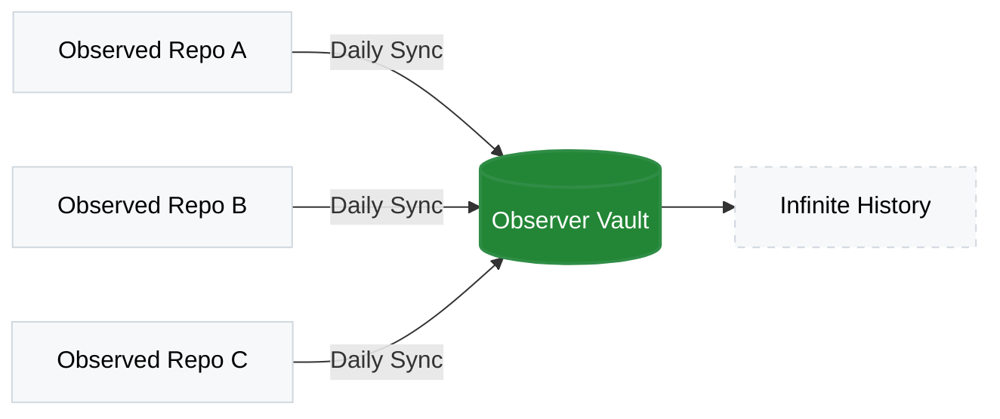

# GitHub Traffic Archiver 📊


This is a GitHub Action designed to automate the collection and archival of repository traffic statistics (clones and views). It solves the "14-day limit" problem of GitHub's native traffic insights by persisting daily metrics into a central storage repository, creating a permanent historical record.

---

## Beyond the 14-Day Limit

GitHub only keeps your traffic data for 14 days. This action ensures you never lose a single view or clone by archiving them into a permanent vault.



---

### Why use this?

| Feature | The Observer Advantage |
| --- | --- |
| **Speed** | **60-Second Setup.** No complex Docker or Python environments; just a pure Composite Action. |
| **Privacy** | **Total Ownership.** Your metrics never leave GitHub. They move from one private repo to another. |
| **Portability** | **Clean CSVs.** No proprietary formats. Just raw data ready for Excel, Sheets, or Python. |
| **Centralization** | **Multi-Repo Support.** One "Observer" repo can track an unlimited number of "Observed" repos. |
| **Automation** | **Set & Forget.** Runs on a cron schedule so your history grows while you sleep. |

---

## 🚀 Quick Start (60 Seconds)

Stop losing your data in three easy steps:

### 1. Launch your Observatory

Click [**Use this template**](https://github.com/groda/observatory-dashboard/generate) to create an _observer_ repository to act as your database. 

> [!IMPORTANT]
> Make sure to set the repository to **Private** during setup to keep your traffic data secure.

### 2. Generate a Token

Create a [Fine-grained Personal Access Token](https://github.com/settings/tokens?type=beta) with **Read & Write** access to:
 - your new _observer_ repo
 - all repos you want to collect metrics for (the _observed_ projects).
 
 Add it as an actions Secret named `METRICS_PAT` in your observer and observed repositories.

### 3. Add the Workflow

Create `.github/workflows/metrics.yml` each the _observed_ project (the project you want to collect metrics for) and paste this:

```yaml
name: Archive Traffic
on:
  schedule:
    - cron: '0 0 * * *' 
  workflow_dispatch:

jobs:
  backup:
    runs-on: ubuntu-latest
    steps:
      - uses: groda/github-traffic-archiver@v2
        with:
          metrics-repo: 'YOUR-USERNAME/observatory-dashboard'
          metrics-pat: ${{ secrets.METRICS_PAT }}
```
> [!IMPORTANT] 
> The `METRICS_PAT` must be a Personal Access Token with **'Repository Contents: Write'** access for both the repository you are monitoring and the repository where you are storing the data.

---

## 📊 Visualize Your Data
Don't just collect data—see it! 

Use the [**Observatory Dashboard Template**](https://github.com/YOUR_USERNAME/observatory-dashboard) to instantly generate interactive, dark-mode charts from the data collected by this Action.

[](https://github.com/YOUR_USERNAME/observatory-dashboard)
*Click to view the Template Repository*

---

## 🏗 Architecture

The system follows a streamlined **Action-based architecture** to maintain security and organization:

1. **The Action (`traffic-archiver-action`)**: This repository contains the `action.yml` logic. It is the engine that fetches data and processes the CSVs.
2. **Observed Repo(s)**: The repositories you want to track. Each one runs a simple daily workflow that calls the Action.
3. **Metrics Vault (`metrics-database`)**: The central storage repository where `.csv` files are maintained and updated.

### 🔒 Recommended "Metrics Vault" Setup

For maximum security and clarity, your storage repository should be configured as follows:

* **Visibility: Private** 🔒
Your traffic statistics, clones, and unique viewer counts are sensitive business intelligence. Keeping this repo private ensures your analytics aren't publicly exposed.
* **Purpose**: A dedicated central "database" for your `.csv` files.
* **Why a Separate Repo?**:
* **Clean History:** Prevents your source code repos from being cluttered with daily automated "metrics" commits.
* **Centralized Analytics:** You can track 50 different projects and have them all report to this single repo, making it easy to run one dashboard for your entire portfolio.
* **Persistent Data:** Even if you delete or rename a source repository, your historical data remains safe in the vault.

### 🔑 Security Note: The `METRICS_PAT`

Because the **Metrics Vault** is private, the Action requires a Personal Access Token (PAT) with `repo` scope. This token allows the Action to securely "tunnel" the data from your public repositories into your private vault.

---

### 🔍 How it Works

GitHub only keeps traffic data (clones and visitors) for **14 days**. This workflow acts as a "Data Logger":

1. It wakes up every day and asks the GitHub API for the clone and view history of the **Observed Repo**.
2. It compares this data with the existing logs in your **Observer Repo**.
3. It appends only the most recent data and updates the "14-day total" summary.
4. It deduplicates the file and sorts it so the most recent stats are always at the top.

> [!IMPORTANT]
> **Access Requirement:** Access Requirement: You must have owner or collaborator permissions on **both** the Observed and Observer repositories. This workflow uses a Personal Access Token (PAT) to **read** private traffic data from the source and **write** the archived logs to this repository.

---

## 🔐 Security & Permissions

To allow a workflow running in an **Observed Repo** to write data to the **Observer Repo**, specific permissions must be configured via a Fine-Grained Personal Access Token (PAT).

### 1. The Personal Access Token (PAT)

Create a token named **"Metrics Workflow"** in your [Developer Settings](https://github.com/settings/tokens?type=beta) under Personal Access Tokens/Fine-grained tokens:

* **Repository access**:
 * Select **Only select repositories**.
 * Include all **Observed Repositories** AND the **Observer Repository**.


* **Permissions**:
 * `Administration`: Read-only (required for some traffic API metadata).
 * `Metadata`: Read-only.
 * `Contents`: **Read & Write** (Required to push `.csv` updates).


### 2. Repository Secrets

In **each** Observed Repo (Settings > Secrets and variables > Actions), add the following secret:

* **Name**: `METRICS_PAT`
* **Value**: Paste the token generated above.

> [!NOTE]
> While it may seem like the Observer repo doesn't need a "separate" PAT, it is actually covered by the **"Metrics Workflow" PAT** you created. Because that single token has "Write" access to the Observer repo, it can push the data once the workflow finishes gathering it.


---

## 🚀 Usage

> [!IMPORTANT]
> The auto-generated "Installation" snippet on the Marketplace sidebar is incomplete. 
> To archive data, you **must** include the permissions and token blocks below.

Create a file `.github/workflows/run-archiver.yml` in an **Observed Repo**:

```yaml
name: Collect Metrics

on:
  schedule:
    - cron: '0 0 * * *' # Runs daily at midnight
  workflow_dispatch:    # Allows manual triggering

permissions:
  contents: read

jobs:
  record-stats:
    runs-on: ubuntu-latest
    steps:
      - name: Checkout
        uses: actions/checkout@v4

      - name: Run Traffic Archiver
        uses: groda/github-traffic-archiver@v2
        with:
          metrics-repo: 'YOUR-USERNAME/observer-repo'
          metrics-pat: ${{ secrets.METRICS_PAT }}
          # observed-repo defaults to the current repo if omitted
```

This is your caller workflow for the observed repository.

---

## 📊 Data Architecture

The workflow automates the collection of traffic data into a persistent CSV format. Unlike the default GitHub dashboard, this data never expires.

### Storage Logic

The system generates or updates a CSV file named using the pattern `[YOUR-USERNAME]_[repo].csv` (e.g., `groda_my-project.csv`). This file is automatically committed to your **Observer Repository**.

### Configuration

To set up your storage destination, update the `with` block in your workflow file:

```yaml
with:
  # The central repository where CSV files are stored
  metrics-repo: YOUR-USERNAME/observer-repo

```

### File Structure

Each CSV is optimized for easy sorting and long-term analysis:

| Column | Description | Example |
| --- | --- | --- |
| **Date** | The date the data was captured (YYYY-MM-DD) | `2024-05-20` |
| **Repository** | The name of the observed repository | `groda/color-combinations` |
| **Type** | Type of metric ("view" or "clone") | `view` |
| **Count** | Total number of times the repo was cloned that day | `42` |
| **Uniques** | Number of unique GitHub accounts that cloned | `12` |

> **Note:** The workflow uses a "smart merge" logic. It checks the existing CSV in your Observer repo first, appends only the newest data, and ensures no duplicate dates are recorded.

In addition to daily stats **14-day Totals** records are recorded as `YYYY-MM-DD~ 14-day total`. The use of the tilde (`~`) ensures that in a descending sort, the **Total** summary for a specific day appears immediately **above** the individual daily stats for that same day.

---

## 🛠 Maintenance

* **Adding Repos**: To track a new repository, simply add the `METRICS_PAT` secret to the new repo and create the caller workflow.
* **Data Integrity**: The workflow uses `awk` to ensure that if it runs multiple times in one day, only the most recent (most complete) data point is saved, preventing duplicates.

---

## 🛡️🔐 Single Token vs. High Security

This workflow requires cross-repository permissions. You can choose between a **Standard** setup (the current setup, easier to maintain) or a **High Security** setup (follows the Principle of Least Privilege).

### Option 1: Standard Setup (Single Token)

Recommended for solo developers or small setups.

* **Token Name**: `Metrics-Unified-Token`
* **Scope**: All Observed Repos **AND** the Observer Repo.
* **Permissions**:
* `Metadata`: Read-only
* `Administration`: Read-only
* `Contents`: **Read & Write**


* **Workflow Secret**: Store as `METRICS_PAT` in all Observed repos.

### Option 2: High Security Setup (Dual Token)

Recommended for teams or sensitive source code. This ensures the "Writer" token cannot be used to modify source code in your Observed repositories.

#### A. The "Traffic Reader" Token

* **Scope**: All **Observed Repos** only.
* **Permissions**: `Metadata` (Read), `Administration` (Read).
* **Usage**: Used by the workflow to fetch clone data from the GitHub API.
* **Secret Name**: `READER_PAT`

#### B. The "Database Writer" Token

* **Scope**: The **Observer Repo** only.
* **Permissions**: `Contents` (Read & Write).
* **Usage**: Used by the workflow to `git push` the CSV file.
* **Secret Name**: `WRITER_PAT`

---

## 🛡️🚀 Usage (High Security Example)

If you choose the **High Security** route, update your caller workflow in the Observed Repo as follows:

```yaml
jobs:
  update-metrics:
    # You can point this to your own forked workflows repo if preferred
    uses: groda/github-clone-archiver/.github/workflows/metrics.yml@v1
    with:
      metrics-repo: YOUR-USERNAME/observer-repo
    secrets:
      # We pass the Writer token to the reusable workflow
      # so it can push to the central database repo
      METRICS_PAT: ${{ secrets.WRITER_PAT }}

```

> [!TIP]
> **Why do we pass the Writer token?** > The GitHub Actions default `GITHUB_TOKEN` can read the current repo's traffic. By passing the `WRITER_PAT` as the `METRICS_PAT` secret, the workflow gains the specific authority needed to write to the **Observer Repo** without needing permission to write to your source code.

---

## 🛡️🗂️ Permission Table Reference

| Permission | Requirement | Reason |
| --- | --- | --- |
| `Metadata` | Read | Basic repository access |
| `Administration` | Read | Required to access `/traffic/clones` API |
| `Contents` | Read/Write | Required to push `.csv` changes to Observer Repo |

---

### How to verify your permissions

If the workflow fails with a `403 Forbidden` error during the **push** phase, check that your PAT (the one passed to `METRICS_PAT`) has `Contents: Write` access specifically for the **Observer Repo**.
